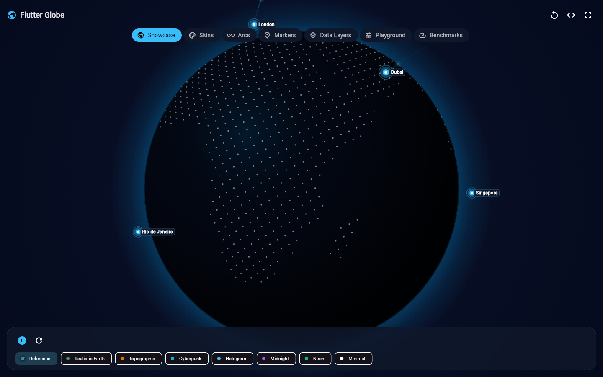
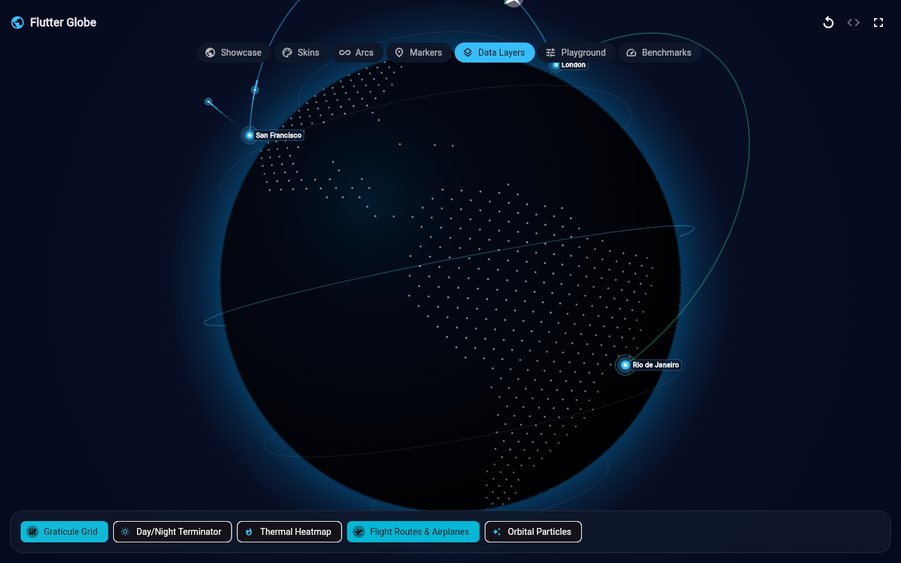

<p align="center">
  
</p>

# Flutter Globe

Interactive Canvas globes for Flutter with markers, animated routes, themes, data layers, and camera controls.

[](https://pub.dev/packages/flutter_globe)
[](https://github.com/ariaramin/flutter_globe/actions/workflows/ci.yml)
[](LICENSE)

`flutter_globe` draws directly with Flutter Canvas. It needs no WebView, map tiles, API key, or 3D engine.

## What you get

- Perspective and orthographic globes with drag, momentum, pinch zoom, and automatic rotation.
- Geographic markers, labels, pulses, animated arcs, and multi-stop routes.
- Grid, heatmap, region, label, particle, and day/night layers.
- 24 themes, animated theme transitions, camera controls, templates, and reduced-motion support.
- A responsive example with a Playground and deterministic benchmark scenes.

This package is for visualization. It is not a navigation map, geocoder, or precise GIS boundary source.

## Install

```bash
flutter pub add flutter_globe
```

Or add it manually:

```yaml
dependencies:
  flutter_globe: ^1.0.2
```

## Create your first globe

```dart
import 'package:flutter/material.dart';
import 'package:flutter_globe/flutter_globe.dart';

void main() => runApp(const MaterialApp(
  home: Scaffold(
    backgroundColor: Color(0xFF020617),
    body: Center(
      child: SizedBox.square(
        dimension: 360,
        child: Globe(),
      ),
    ),
  ),
));
```

`Globe` needs bounded space. Inside a `Column` or scroll view, wrap it with `SizedBox`, `AspectRatio`, or `Expanded`.

## Preview

The images below come from the package's release example, not a design mockup.





## Add markers and routes

```dart
const london = GlobeCoordinate(latitude: 51.5074, longitude: -0.1278);
const tokyo = GlobeCoordinate(latitude: 35.6762, longitude: 139.6503);

const Globe(
  markers: [
    GlobeMarker(coordinate: london, label: 'London', pulse: true),
    GlobeMarker(coordinate: tokyo, label: 'Tokyo'),
  ],
  arcs: [
    GlobeArc(
      start: london,
      end: tokyo,
      altitude: 0.28,
      duration: Duration(seconds: 3),
      repeat: true,
    ),
  ],
);
```

Use `onMarkerTap` to connect marker selection to your application state. Validate external coordinates with `GlobeCoordinate.normalized`.

## Change the look and interaction

Start with a built-in skin:

```dart
const Globe(
  skin: GlobeSkins.cyberpunk,
  projection: GlobeProjection.perspective,
  enableZoom: true,
  autoRotate: true,
  autoRotateSpeed: 0.35,
);
```

Or customize a theme:

```dart
Globe(
  theme: GlobeSkins.midnight.copyWith(
    surface: GlobeSkins.midnight.surface.copyWith(
      landColor: Colors.tealAccent,
      pointSize: 2,
    ),
    atmosphere: const GlobeAtmosphereStyle(color: Colors.teal),
  ),
);
```

When both are provided, `theme` overrides `skin`. Explicit widget interaction values override the matching grouped interaction settings.

## Control the camera

```dart
final controller = GlobeController(autoRotate: false);

controller.lookAt(
  const GlobeCoordinate(latitude: 51.5074, longitude: -0.1278),
);
controller.zoom = 1.3;

final globe = Globe(controller: controller);

// Dispose controllers created by your State.
controller.dispose();
```

Animated camera methods require a `TickerProvider`. See the [controller lifecycle guide](doc/controller.md) for a complete StatefulWidget example.

## Use layers or a ready-made scene

```dart
const Globe(
  layers: [
    GlobeGridLayer(),
    GlobeHeatmapLayer(points: [
      GlobeHeatPoint(
        coordinate: GlobeCoordinate(latitude: 35.6762, longitude: 139.6503),
        intensity: 0.8,
      ),
    ]),
  ],
);
```

For a populated scene:

```dart
Globe.template(
  GlobeTemplates.globalNetwork,
  introAnimation: GlobeIntroAnimations.reference,
  size: 400,
);
```

## Run the example

```bash
cd example
flutter pub get
flutter run -d chrome
```

The example includes Showcase, Skins, Arcs, Markers, Data Layers, Playground, and Benchmarks. The Playground can change themes, projection, quality, interaction, lighting, atmosphere, arcs, and markers, then copy matching Dart code.

## Performance

Use `GlobeQuality.auto` unless you have measured a reason to choose another level. For dense scenes, reduce labels, particles, arcs, and overlays before increasing quality.

The example benchmark uses fixed seeded workloads and engine frame timings. It does not claim device-independent FPS, GPU execution time, or memory usage. Run it in profile mode on the target device:

```bash
cd example
flutter run --profile -d YOUR_DEVICE_ID
```

## Documentation

| Goal | Guide |
| --- | --- |
| Install and integrate | [Getting started](doc/getting_started.md) |
| Mark locations | [Markers](doc/markers.md) |
| Draw connections | [Arcs and routes](doc/arcs.md) |
| Add overlays | [Layers](doc/layers.md) |
| Configure appearance | [Customization](doc/customization.md) and [themes](doc/skins_and_themes.md) |
| Control movement | [Interaction](doc/interaction.md), [controller](doc/controller.md), and [intro animation](doc/intro_animation.md) |
| Tune dense scenes | [Performance](doc/performance.md) and [benchmarks](doc/benchmarks.md) |
| Handle inclusive UX | [Accessibility](doc/accessibility.md) |
| Solve a problem | [FAQ](doc/faq.md) and [troubleshooting](doc/troubleshooting.md) |
| Understand the API | [API overview](doc/api.md) |

## Platform status

The package uses Flutter Canvas and no platform plugin. Web release builds and responsive behavior are verified. CI tests Flutter 3.27.4 and the current release SDK. Android, iOS, macOS, Windows, and Linux still need broader real-device validation.

The Canvas exposes one configurable semantic image label. If individual locations must be accessible, provide equivalent Flutter controls or a parallel semantic list. Reduced-motion mode disables decorative scene motion while keeping the static visualization available.

## Contributing and license

Issues and focused pull requests are welcome. Read [CONTRIBUTING.md](CONTRIBUTING.md), the [Code of Conduct](CODE_OF_CONDUCT.md), and the [security policy](SECURITY.md) first.

Flutter Globe is available under the [MIT license](LICENSE). The bundled offline land point cloud is derived from Natural Earth public-domain data; see [ATTRIBUTION.md](ATTRIBUTION.md).
